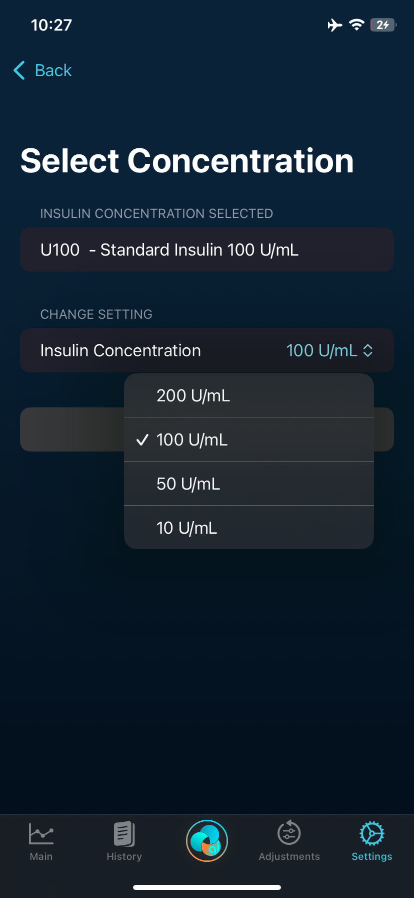
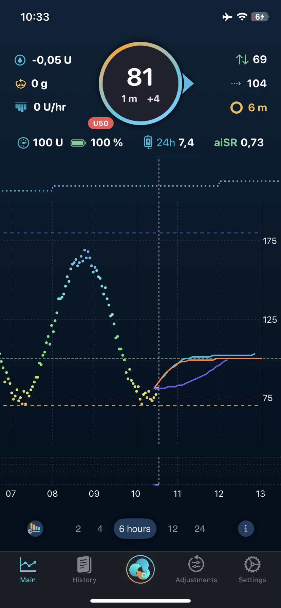
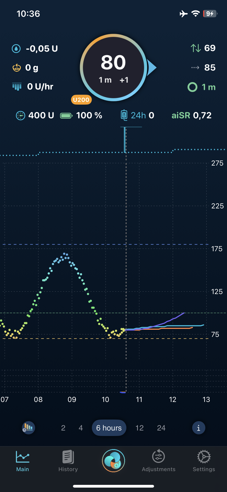
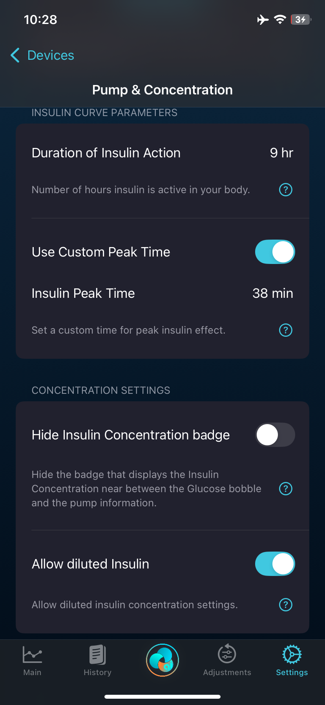
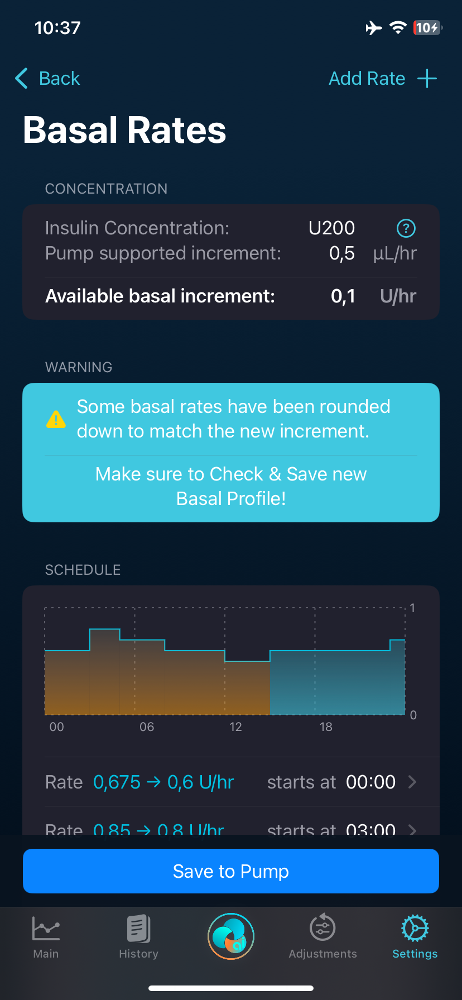
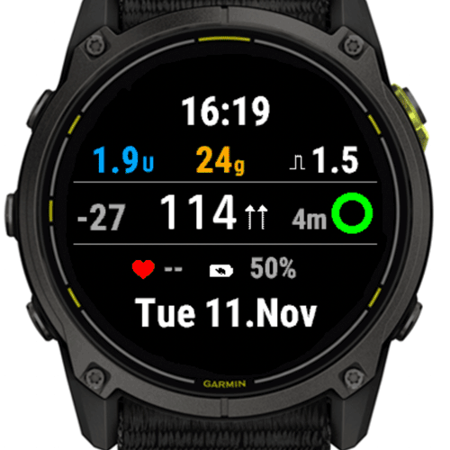
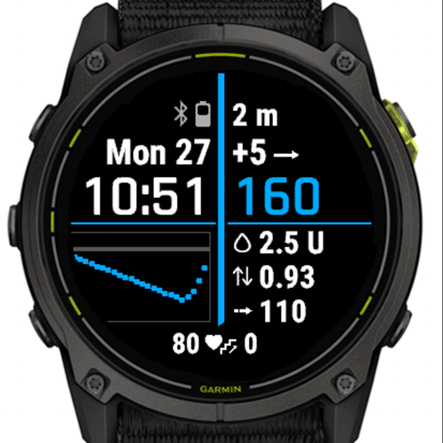
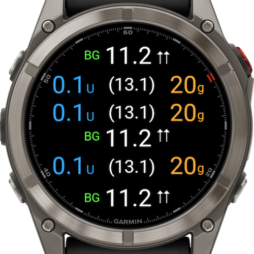
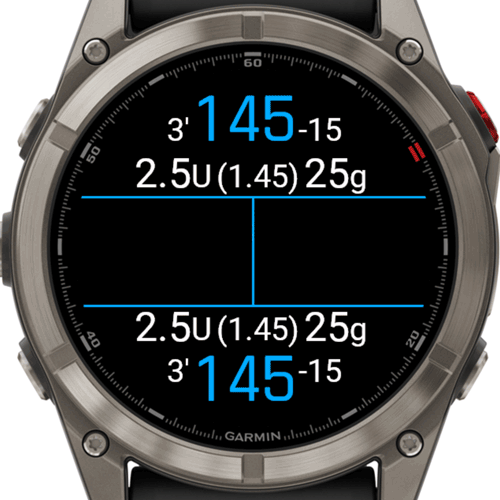

# **T**rio **a**uto**I**SF fork aka *Tai*

## Introduction of Trio

Trio - an automated insulin delivery system for iOS based on the OpenAPS algorithm with [adaptations for Trio](https://github.com/nightscout/trio-oref).

The project started as Ivan Valkou's [FreeAPS X](https://github.com/ivalkou/freeaps) implementation of the [OpenAPS algorithm](https://github.com/openaps/oref0) for iPhone, and was later forked and rebranded as iAPS. The project has since seen substantial contributions from many developers, leading to a range of new features and enhancements.

Following the release of iAPS version 3.0.0, due to differing views on development, open source, and peer review, there was a significant shift in the project's direction. This led to the separation from the [Artificial-Pancreas/iAPS](https://github.com/Artificial-Pancreas/iAPS) repository, and the birth of [Trio](https://github.com/nightscout/Trio.git) as a distinct entity. 

## What is autoISF?
The vast majority of the autoISF design and development effort was done by [ga-zelle](https://github.com/ga-zelle) with support from
  [swissalpine](https://github.com/swissalpine), [claudi](https://github.com/lutzlukesch),
  [BerNie](https://github.com/bherpichb), [mountrcg](https://github.com/mountrcg),
  [Bjr](https://github.com/blaqone) and [Tobias](https://github.com/T-o-b-i-a-s).

autoISF adds more power to the oref1 algorithm used in Trio by adjusting the insulin sensitivity based on different scenarios (e.g. high BG,
accelerating/decelerating BG, BG plateau). autoISF has many different settings to fine-tune these adjustments.
However, it is important to start with well-tested basal rate and settings for insulin sensitivity and carb ratios.

*Tai* is based on dev from the original [Trio repo](https://github.com/nightscout/trio) and includes the implementation of [autoISF by ga-zelle](https://github.com/T-o-b-i-a-s/AndroidAPS) for AAPS and some other extra features.

autoISF is off by default.

autoISF adjusts ISF depending on 4 different effects in glucose behaviour that autoISF checks and reacts to:
* acce_ISF is a factor derived from acceleration of glucose levels
* bg_ISF is a factor derived from the deviation of glucose from target
* pp_ISF are factors derived from glucose rise, 5min, 10min and 45min deltas
* dura_ISF is a factor derived from glucose being stuck at high levels


## Insulin Concentrations

Tai can handle dosing of insulin in the following concentrations:
* standard insulin U100 - 100 IU per ml
* high concentration insulin U200 - 200 IU per ml
* diluted insulins
  * U50 - 50 IU per ml
  * U10 - 10 IU per ml

| Concentrations | diluted | concentrated |
| --- | --- | --- |
|  |  |  |

 The pump and the pump drivers always assume standard U100 insulin and are basing all their calculations of IU delivered on that assumption. Introducing different concentration to Tai means, that the app does all the very simple calculations to ensure the proper use of Insulin Units independant of the concentration of the insulin in the pump. So for delivering 1 IU of (a) U50, the pumpdriver will get the information delivering double the volume of liquid, compared to 1 IU of (b) U100 insulin. However if one would look into the pump itself it would acount 2 IU in case (a) and 1 IU for case (b). The UI in Tai would of course account for 1 IU in both cases!

 ### Benefit

 Independant of concentration of insulin used, all therapy parameters and the statistics re. insulin usage are always the same accross different insulin concentrations.

 ### Considerations & Precautions

 Insulin concentration is not only changing the volume of liquid delivered by the pump for a set amount of IU but it also changes the possible pump incremnts in IU. So with a U10 insulin in a dash pod the smallest bolus or increment can be 0.005 IU, whereas for U200 insulin in the same pump it would be 0.1 IU. So increment is a combination of concentration and pump specific bolus/basal increment.
 As a result I decided if you want to change the concentration of your insulin, you first need to delete your current pump. Insulin can only be changed with a reservoir refill or a pod change. That is nothing I can reliably check pump driver independant in the app. Also the the pump natural increments only get set and updated when adding the pump. Therefore I apllied the stricter rule to only be able to set the concentration when no pump is added. So once you set the concentration and add your pump, the increments for bolus and basal delivery will be set and also be available in your basal profile, pump limits, max IOB etc.

 ### Configuration

 I have moved all insulin related settings to the pump (Settings > Devices > Insulin Pump & Concentration). This includes settings for DIA and insulin peak times. Those are essentialy parameters of your insulin and not of your therapy (debateable).
 
 

There are some hints and warnings in Tai that guide you to change some increment related settings if you change insulin concentration. E.g. if you switch to a higher concentrated insulin your current basal profile might need adjustment as basal increment supported now increased.



## AIMI B30
Another new feature is an enhanced EatingSoon TT on steroids. It is derived from AAPS AIMI branch and is called B30 (as in basal 30 minutes).
B30 enables an increased basal rate after an EatingSoon TT and a manual bolus. The theory is to saturate the infusion site slowly & consistently with insulin to increase insulin absorption for SMB's following a meal with no carb counting. This of course makes no sense for users striving to go Full Closed Loop (FCL) with autoISF. But for those of you like me, who cannot use Lyumjev or FIASP this is a feature that might speed up your normal insulin and help you to not care about carb counting, using some pre-meal insulin and let autoISF handle the rest.

To use it, it needs 2 conditions besides setting all preferences:
* Setting a TT with a specific adjustable target level.
* A bolus above a specified level, which results in a drastically increased Temp Basal Rate for a short time. If one cancels the TT, also the TBR will cease.

## Ketoacidosis protection
Ketoacidosis protection will apply a small configurable TempBasalRate always or if certain conditions arise instead of a Zero temp! The feature exists because in special cases a person could get ketoacidosis from 0% TBR. The idea is derived from sport. There could be problems when a basal rate of 0% ran for several hours. Muscles in particular could shut off.

This feature enables a small safety TBR to reduce the ketoacidosis risk. Without the Variable Protection Strategy that safety TBR is always applied. The idea behind the variable protection strategy is that the safety TBR is only applied if sum of basal-IOB and bolus-IOB falls negatively below the value of the current basal rate and that current isulin activity is below 0.

## Exercise Modes & Advanced TT's
Exercise Mode with high/low TT can be combined with autoISF. The ratio from the TT, calculated with the Half Basal Exercise target, will be adjusted with the strongest (>1) or weakest (<1) ISF-Ratio from autoISF. This can be substantial. I myself prefer to disable autoISF adjustments while exercising, relying on the TT Ratio, by setting `Exercise toggles all autoISF adjustments off` to on.

Trio has implemented the excercise targets with configurable half basal exercise target variable and a specific desired insulin ratio. This requires highTTraisesSens and lowTTlowersSens setting. You first define at which TT level you want to be. Frome this the available insulin percentages are derived:
* with a TT above 100mg/dL you can only have a insulin percentage below 100% (more sensitive to insulin while exercising)
* If you don't have the setting exercise mode or highTTraisesSens enabled, you will not be able to specify an insulin percentage below 100% with a high TT.
* with a TT below 100 mg/dL you can have an Insulin ratio above 100% (less sensitive to insulin) but less than what your autosens_max setting defines. E.g. if you have autosens_max = 2, that means your increased insulin percentage can be max. 200%.
* If you have lowTTlowersSens disabled or you have autosens_max=1, you cannot specify a percentage >100% for low TTs.

If you do have the appropriate settings, you can chose an insulin ratio with the slider for the TT you have set and the half basal exercise target will be calculated and set in background for the time the TT is active.

## Garmin Watchface & Datafield Support

Tai includes native support for Garmin devices through a companion watchface and datafield. The watchface displays current glucose values, trend arrows, IOB, COB, and loop status directly on your Garmin watch. The datafield can be added to activity profiles, allowing you to monitor your glucose and insulin data during workouts without switching screens.

Communication between Tai and the Garmin device is established via Garmin Connect IQ, after that all comms is directly between Tai and device - 100% offline functionality. Due to this offline capability, watchface and datafield settings are configured directly in Tai rather than through Garmin Connect.
Both watchface and datafield are available through the [Garmin Connect IQ Store](https://apps.garmin.com/de-DE/developer/eae8d754-7a90-4cc7-85f1-95d12ea93490/apps).

| | Original | Swissalpine |
|---|---|---|
| **Watchface** |  ⭐ recommended |  |
| **Datafield** |  |  ⭐ recommended |

# Installation

In Terminal, `cd` to the folder where you want your download to reside, change `<branch>` in the command below to the branch you want to download (ie. `dev`), and press `return`.

```
git clone --branch=dev --recurse-submodules https://github.com/mountrcg/Tai.git && cd Tai
```

Create a ConfigOverride.xcconfig file that contains your Apple Developer ID (something like `123A4BCDE5`). This will automate signing of the build targets in Xcode:

Copy the command below, and replace `xxxxxxxxxx` by your Apple Developer ID before running the command in Terminal.

```
echo 'DEVELOPER_TEAM = xxxxxxxxxx' > ConfigOverride.xcconfig
```

Then launch Xcode and build the Tai app:
```
xed .
```

## To build directly in GitHub, without using Xcode:

**Instructions**:

For main branch:
* https://github.com/mountrcg/Tai/blob/main/fastlane/testflight.md

For dev branch:
* https://github.com/mountrcg/Tai/blob/dev/fastlane/testflight.md

Instructions in greater detail:
* https://triodocs.org/install/build/browser/browser-build-overview/


## Please understand that Trio with autoISF aka Tai:
- is an open-source system developed by enthusiasts and for use at your own risk
- for  only
- and not CE or FDA approved for therapy.

## autoISF Support & Documentation
* Please visit ga-zelle’s repository [GitHub - ga-zelle/autoISF](https://github.com/ga-zelle/autoISF/tree/A3.2.0.4_ai3.0.1).
  The [**Quick Guide (bzw. Kurzanleitung)**](https://github.com/ga-zelle/autoISF/blob/A3.2.0.4_ai3.0.1/autoISF3.0.1_Quick_Guide.pdf) provides an overview of autoISF and its features. All of this is applicable for Tai as the core Algorithm is 100% identical.

Most of the changes for *autoISF* are made in oref code of OpenAPS, which is minimized in Tai. So it is not really readable in Xcode, therefore refer to my [oref0-repository](https://github.com/mountrcg/oref0).

Not a lot of support on top of Trio. Tai is for enthusiast willing also to go the extra technical mile, visit [FCL & autoISF Discord](https://discord.gg/KUa8Nf2eeU)

## Trio Documentation

... can be found in the original [READ.me for Trio](https://github.com/nightscout/Trio/blob/main/README.md)
